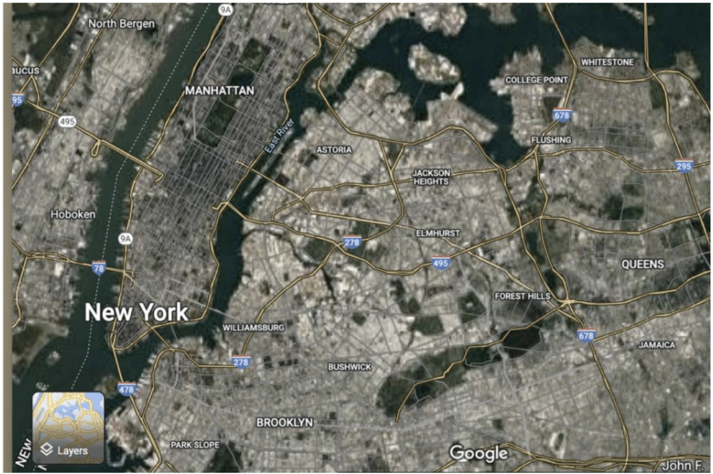
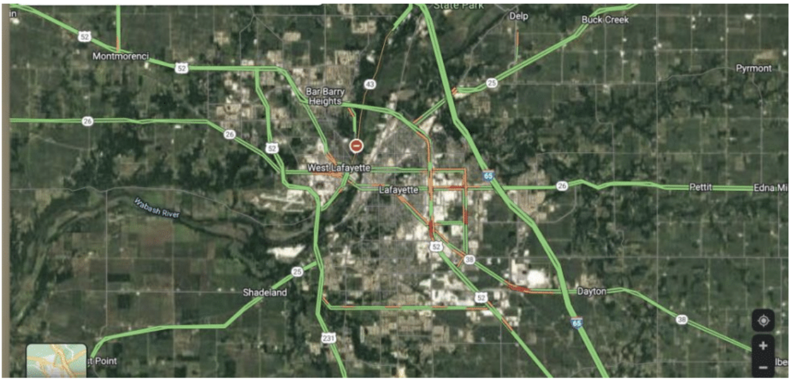

 

# Overview of DUST data

### <Data overview >

## Dust Project workflow

## DUST< project-wide workflow text>
 
 

<!-- 
 -->
<!-- 
 -->
<!--  -->
<!-- 
 -->
<!-- 
 -->
<!--   -->
<!-- <h4> &nbsp;&nbsp; <u>Direct Links</u> </h3> -->
<!--   -->
<!--    -->
<!--    -->
<!--    -->
<!--    -->
<!--    -->
<!--    -->
<!--    -->
<!--    -->
<!--    -->
<!-- 
 -->
<!-- 
 -->
<!--   -->
<!--   -->

<!-- ## Video Data -->

<!-- All data collections will be recorded on video. -->
<!-- Parents will be asked for their permission to share the video recordings and other data with the research community. -->
<!-- When that permission is granted the videos and related data will be shared with the research community via [Databrary](http://databrary.org): -->

<!-- - Adolph, K., Tamis-LeMonda, C., Gilmore, R.O. & Soska, K. (2016). PLAY Project: NICHD Workshop (2016-12-16). Databrary. http://doi.org/10.17910/B7.254. -->
<!-- - Adolph, K., Tamis-LeMonda, C., Gilmore, R.O. & Soska, K. (2018). Play & Learning Across a Year (PLAY) Project Summit (2018-06-29 Philadelphia). Databrary. http://doi.org/10.17910/B7.724 -->
<!-- - Adolph, K., Tamis-LeMonda, C., Gilmore, R.O. & Soska, K. (2019). Play and Learning Across a Year (PLAY) Project - Protocols & Documentation. Databrary. http://doi.org/10.17910/b7.876.  -->

<!-- #### Full DUST home visit - example -->

<!-- Videos of a full PLAY home visit protocol are available publicly on the DUST protocol [Databrary Volume](https://nyu.databrary.org/volume/876) .  -->

<!-- 
 -->
<!--    -->
<!--   <button size="xs" type="button" data-toggle="collapse" data-target="#fullvideohomevisit"> -->
<!-- Full-length video of home visit -->
<!--   </button> -->
<!-- 
 -->
<!-- 
 -->
<!--   <video width="100%" controls="" preload="none"> -->
<!--     <source src="https://nyu.databrary.org/slot/55651/0,7820438/asset/337402/download?inline=true" type="video/mp4"> Your browser does not support html5 video. -->
<!--   </video> -->
<!-- 
 -->

<!-- 
 -->
<!--    -->
<!--   <button size="xs" type="button" data-toggle="collapse" data-target="#onehournaturalplay"> -->
<!-- One-hour natural play -->
<!--   </button> -->
<!-- 
 -->
<!-- 
 -->
<!--   <video width="100%" controls="" preload="none"> -->
<!--     <source src="https://nyu.databrary.org/slot/55651/7821438,11460201/asset/337405/download?inline=true" type="video/mp4"> Your browser does not support html5 video. -->
<!--   </video> -->
<!-- 
 -->

<!-- 
 -->
<!--    -->
<!--   <button size="xs" type="button" data-toggle="collapse" data-target="#housewalkthrough"> -->
<!-- House walkthrough -->
<!--   </button> -->
<!-- 
 -->
<!-- 
 -->
<!--   <video width="100%" controls="" preload="none"> -->
<!--     <source src="https://nyu.databrary.org/slot/55651/11461201,12477351/asset/337415/download?inline=true" type="video/mp4"> Your browser does not support html5 video. -->
<!--   </video> -->
<!-- 
 -->

<!-- 
 -->
<!--    -->
<!--   <button size="xs" type="button" data-toggle="collapse" data-target="#structuredplay"> -->
<!-- Five-minute structured play -->
<!--   </button> -->
<!-- 
 -->
<!-- 
 -->
<!--   <video width="100%" controls="" preload="none"> -->
<!--     <source src="https://nyu.databrary.org/slot/55651/12478351,12812325/asset/337416/download?inline=true" type="video/mp4"> Your browser does not support html5 video. -->
<!--   </video> -->
<!-- 
 -->

<!-- 
 -->
<!--    -->
<!--   <button size="xs" type="button" data-toggle="collapse" data-target="#questionnaires"> -->
<!-- Parent-report questionnaires -->
<!--   </button> -->
<!-- 
 -->
<!-- 
 -->
<!--   <video width="100%" controls="" preload="none"> -->
<!--     <source src="https://nyu.databrary.org/slot/55651/12813325,14619256/asset/337417/download?inline=true" type="video/mp4"> Your browser does not support html5 video. -->
<!--   </video> -->
<!-- 
 -->

<!-- _NOTE: This participant was not the only child in the home, so would not meet inclusion criteria for PLAY._ -->

<!-- ## Parent-report (questionnaire) data -->

<!-- <!-- PLAY researchers will collect and share a substantial corpus of parent-report (questionnaire) data. The full set of self-report questions can be found [here](collection_homevisit_questionnaires.html). --> -->

<!--   -->

# Participant sampling

## <TEXT>

## Inclusion/exclusion criteria

To be included in the DUST sample of 248 sessions, participants must:

- be 6, 9, 12,15, 18, 24-month-olds (+/- 2 weeks)
- born full term (36+ weeks), normal birth weight (>= 2.27kg), without known disabilities (cognitive, auditory, visual, motor)
- Primary caregiver must act as the caregiver during the 1-hour natural interaction, which will be scheduled at a time when only one  caregiver and target child are present (i.e., no siblings or other caregivers are around)
- Infants can come from families speaking any languages as long as caregiver in the home during the 1-hour natural play recording can speak English and answer the questionnaires in English.
- Caregiver is comfortable not wearing a mask during 1-hour natural play recording

## Collection sites {.tabset}

Data will come from the NYC and West Lafayette areas, two geographically- diverse sites representing urban,suburban,and rural communities.  

### Map

<!-- ### Racial composition -->

<!--  -->

<!-- ### Socio-economic status -->

<!--  -->

<!-- ### Education -->

<!--  -->

<!-- ### Languages spoken -->

<!--  -->

